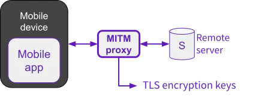

TLS decryption
=======================
.. toctree::
   :maxdepth: 1

.. _SSLKEYLOGFILE: https://tlswg.org/sslkeylogfile/draft-ietf-tls-keylogfile.html
.. _Wireshark: https://www.wireshark.org/
.. _friTap: https://github.com/fkie-cad/friTap
.. _supported SSL/TLS implementations: https://github.com/fkie-cad/friTap
.. _pcapng-utils: https://pts-project.org/pcapng-utils/

How it works
------------------

Decrypting TLS-encrypted network traffic of a mobile application requires specialized techniques to overcome
the security measures employed by the app and the underlying operating system. Two primary techniques can be
employed for this purpose.

Man-in-the-Middle (MITM) attack
~~~~~~~~~~~~~~~~~~~~~~~~~~~~~~~~
MITM attacks involve intercepting and modifying the communication between the mobile app and its intended server.
This requires positioning a proxy or a custom certificate authority (CA) between the app and the server, effectively
impersonating the server to the app and vice versa.

    With Man-in-the-Middle (MITM) attack

To establish the MITM attack, the device’s trust store needs to be modified to accept the custom CA certificate.
This can be achieved by installing a custom root certificate on the device or configuring the app to trust a
specific proxy. Once the MITM proxy is in place, it can intercept the encrypted traffic, decrypt it using its
own private key, and re-encrypt it before forwarding it to the intended server.

**Certificate Pinning** is a security measure that aims to prevent MITM attacks by embedding the server’s certificate
or its public key hash directly into the mobile app. This allows the app to verify the authenticity of the server’s
certificate during communication, ensuring that it is not being intercepted by a malicious proxy.

With certificate pinning in place, the app will only trust connections to the server if the presented certificate
matches the embedded one. This makes it more difficult for attackers to successfully perform MITM attacks, as they
would need to compromise the app itself or the device’s operating system to bypass the pinning mechanism. Disabling
certificate pinning requires root access or a jailbroken device to dynamically **modify the behavior of the
application**.

Certificate pinning enhances the security of mobile app communications, but it also poses challenges for legitimate
security analysis and penetration testing. In such cases, techniques like dynamic instrumentation or memory dumping
may be required to bypass pinning and gain access to the encrypted traffic.

Extracting TLS Keys from the memory
~~~~~~~~~~~~~~~~~~~~~~~~~~~~~~~~~~~~~~~
This technique involves extracting the TLS session keys directly from the device’s memory while the app is actively
communicating with the server. This requires root access or a jailbroken device to gain access to the memory space
where the keys are stored.

    With Octopus

Once root access is obtained, tools like Frida can be used to hook into the app’s memory and extract the TLS session
keys. These keys can then be used to decrypt the captured network traffic offline, revealing the plaintext
communication between the app and the server.

Octopus passively extracts TLS encryption keys directly from the device’s memory using friTap_, without
altering the application or interfering with the TLS handshake. This allows it to decrypt traffic without altering the
app behavior and without modifying or tampering with the network traffic. The app continues to operate as normal,
making detection by security mechanisms far less likely. And, in legal and forensic analysis contexts, ensuring data
integrity is essential, and tooling that does not modify the target application in the course of its analysis is a key
aspect of Octopus.

Check the list of `supported SSL/TLS implementations`_.

With wireshark
------------------
If the captured traffic contains TLS traffic and a SSLKEYLOGFILE_ has been generated by Octopus during the capture,
use the following command to inject the TLS client randoms read from the ``<keylog_file>`` into the PCAPNG file:

.. code-block::

    editcap --inject-secrets tls,<keylog_file> <traffic.pcap> <traffic.pcapng>

Use Wireshark_ to open the PCAPNG file.

With pcapng-utils
---------------------
pcapng-utils_ is a Python-based tool for converting PCAPNG files to HAR files, check its documentation for
more details.

The key features of pcapng-utils_ are:

* Automatic stacktrace identification to add the stacktrace information to each request and response.
* Automatic payload decryption to identifies the payloads that have been encrypted before been transmitted and
  replace by its cleartext.
